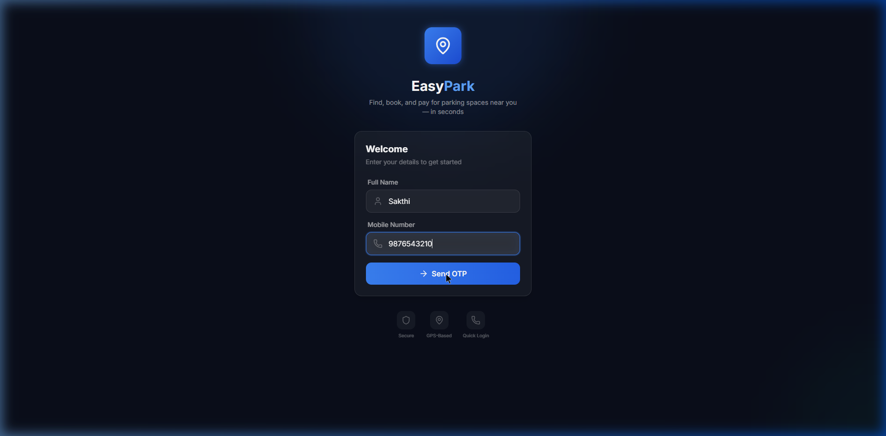
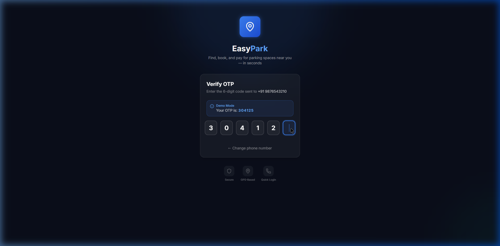
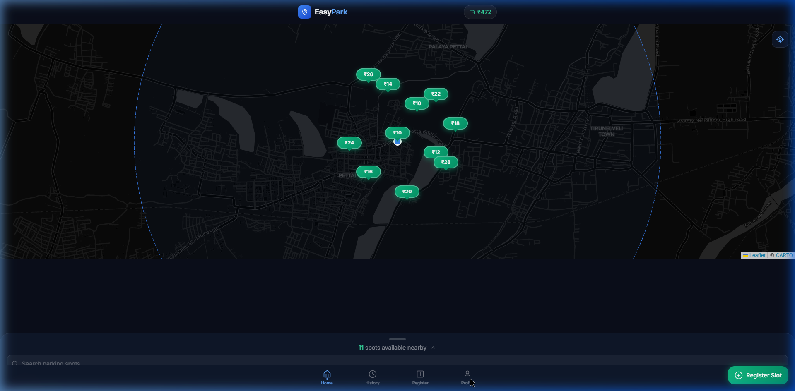

## Easy Park — Walkthrough

This walkthrough confirms the **end-to-end login → OTP → home map flow** and captures the final UI state.

### Screenshots

- **Login**

  

- **OTP**

  

- **Home (Map)**

  

### What to expect on Home

- **Dark-themed Leaflet map** centered on your actual GPS location
- **Nearby parking markers** with green price pills (e.g. ₹10, ₹12, ₹14)
- **Wallet balance** shown top-right
- **Search** and nearby availability text
- **Register Slot** CTA bottom-right
- **Bottom navigation**: Home, History, Register, Profile

### Quick test steps

1. Start dev server: `npm run dev`
2. Open `http://localhost:5173`
3. Enter any name + 10-digit phone
4. Enter the OTP (shown in the demo UI)
5. Verify you land on Home and the map renders with markers near your location

